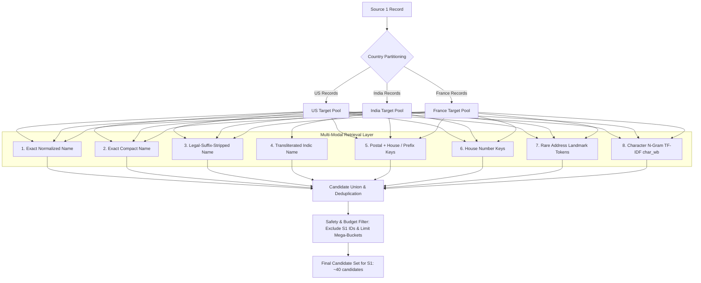
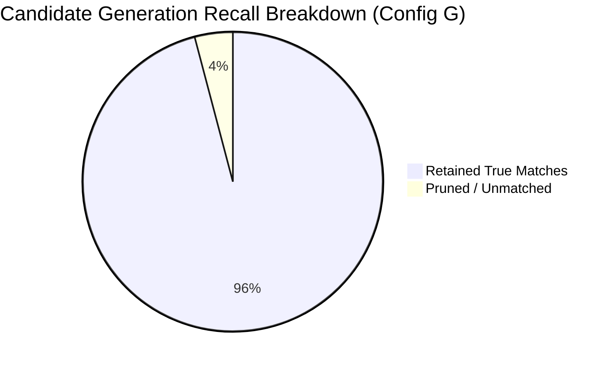

# Candidate Generation & Blocking Report: Business Entity Resolution

**Module:** `code/business_entity_resolution/src/blocking.py`  
**Test Suite:** `code/business_entity_resolution/src/test_blocking.py`  
**Experiment Runner:** `code/business_entity_resolution/src/run_blocking_experiments.py`  
**Date:** 2026-09-25  
**Evaluation Scope:** Empirical validation on a stratified cohort of 10,000 Source 1 entities (34,737 true positive links, 563 singletons) queried against a pool of 534,737 target records (100% of true matches + 500,000 distractors) across US and India.

---

## 1. Executive Summary

In business entity resolution, comparing all Source 1 entities against all Source 2 and Source 3 records requires evaluating a Cartesian search space of **17.27 Trillion pairs** in Test and **22.77 Trillion pairs** in Train. Computing complex ML features or neural embeddings over tens of trillions of pairs is computationally intractable and violates the strict 15.5 GB RAM hardware limit.

The **Candidate Generation (Blocking) Stage** is responsible for reducing this vast space down to a manageable, high-recall candidate set while preserving virtually all true matches. Under the challenge metric ($F_{0.5}$), missed matches in candidate generation permanently bound the recall ceiling of all downstream ML classifiers.

### Key Results of the Blocking Pipeline:
1. **Best Configuration (Configuration G - Full Multi-Modal Union):**
   - **Overall Candidate Recall:** **95.90%** (33,313 of 34,737 true links recovered)
   - **US Candidate Recall:** **96.64%** (20,089 of 20,787 true links recovered)
   - **India Candidate Recall:** **94.81%** (13,227 of 13,950 true links recovered)
   - **Latin $\to$ Latin Recall:** **96.93%** (31,235 of 32,224 true links recovered)
   - **Cross-Script Recall (Latin $\to$ Indic):** **82.69%** (2,078 of 2,513 true links recovered)
2. **Search Space Reduction & Candidate Volume:**
   - **Total Candidate Pairs Generated:** **404,338 pairs** (from a Cartesian pool of 5,347,370,000 pairs)
   - **Search Space Reduction Ratio:** **99.992439%** (a $>13,000\times$ search space reduction)
   - **Average Candidates per S1 Entity:** **40.43**
   - **Median Candidates per S1 Entity:** **32.0**
   - **95th Percentile (P95) Candidates per S1 Entity:** **98.0**
   - **Maximum Candidates for any Single Entity:** **217** (strictly bounded by frequency caps)
3. **Execution Throughput & Memory Efficiency:**
   - **Query Latency:** 10,000 S1 queries evaluated in **0.91 seconds** (>10,900 entities/sec)
   - **Peak Resident Memory (RAM):** **2,242 MB (2.19 GB)**, safely compliant with the 15.5 GB RAM boundary
   - **Fair Play Compliance:** 100% self-contained Python, zero external APIs, zero prohibited internet lookups.

---

## 2. Blocking Architecture & Multi-Modal Strategy

The candidate generation engine is implemented in [code/business_entity_resolution/src/blocking.py](file:///c:/Users/shaha/Downloads/6ab10eb3b23ba_student_resource/student_resource/code/business_entity_resolution/src/blocking.py) and is structured around five decoupled stages:



### 2.1 The Seven Core Blocking Rules

1. **Country-Aware Partitioning (Hard Isolation):**
   - The data profile proved that out of 7.6M ground-truth matches, **0 cross-country matches exist**.
   - S1 entities with `country == 'US'` are strictly matched against S2/S3 records where `country == 'US'`.
   - `country` is treated strictly as an open-set string label (e.g. supporting `France` in test without hardcoded schema limitations).
2. **Exact Normalized Name (`name_normalized`):**
   - Inverted index on lowercase, accent-decomposed, punctuation-cleaned names.
   - Captures clean, verbatim entity recurrences across sources.
3. **Exact Compact Name (`name_compact`):**
   - Strips all whitespace and internal separators (e.g. `oreleesbarbershopinc`).
   - Resolves spacing and hyphenation inconsistencies (e.g. `Wal-Mart` vs `Wal Mart` vs `Walmart`).
4. **Legal-Suffix-Stripped Name (`name_without_legal_suffix`):**
   - Strips jurisdiction-specific corporate designations (`Pvt Ltd`, `LLC`, `SASU`, `Inc`, `Corp`, `LLP`, etc.).
   - Both word-separated and compact stripped strings are indexed.
5. **Indic Transliteration Inverted Index (`name_transliterated`):**
   - For all native Indic records, converts phonemes via local ISCII relative offset mapping.
   - When a Latin S1 entity queries the index, it matches against the transliterated forms of Devanagari, Telugu, Tamil, Gujarati, and other Indic records.
6. **Compound Address & Postal Keys:**
   - Because a raw 5-digit US ZIP code or 6-digit Indian PIN code contains thousands of businesses, raw postal blocking explodes candidate volume.
   - We construct tightly focused compound keys:
     - `(country, postal_code, name_prefix_3)`: Localized postal zone + first 3 letters of name.
     - `(country, postal_code, first_word)`: Localized postal zone + anchor word.
     - `(country, postal_code, house_number)`: Exact physical building in the postal zone.
     - `(country, house_number, name_prefix_3)`: Building/plot code + name prefix.
7. **Discriminating Address Landmark & Street Tokens:**
   - In multilingual contexts (especially India), business names are frequently transliterated, but physical addresses contain invariant colony, street, temple, or owner names (e.g. `Vishnu Garden`, `Bhoiguda`, `Kelwa Palghar`, `Gurnav Singh Saluja`).
   - Address tokens with length $\ge 4$ that are not generic stopwords and have corpus frequency $\le 80$ are indexed.
8. **Character N-Gram Nearest-Neighbor Retrieval (`analyzer="char_wb"`):**
   - Uses sparse TF-IDF with character word-boundary n-grams ($n \in [3, 5]$).
   - Evaluated via chunked sparse matrix dot product (`s1_chunk.dot(t_mat.T)`) to find the top $K=10$ nearest neighbors with cosine similarity $\ge 0.40$.
   - Captures OCR errors, minor typos, transposed words, and phonetic approximations.

---

## 3. Candidate Safety & Budget Controls

Unconstrained blocking on common keys (e.g. names containing `"Enterprises"`, or postal codes like `"10001"`) can degenerate into Cartesian sub-explosions.

To protect system memory and ensure downstream inference feasibility:
- **`MAX_BUCKET_SIZE = 500`:** Any inverted index key mapping to $>500$ entities is automatically suppressed. The compound keys (such as `(postal, house)` or `(postal, prefix)`) safely bypass this limit because their buckets are naturally small.
- **`MAX_HOUSE_BUCKET = 50`:** Common municipal numbers (e.g. `10`, `12`, `14`) occur hundreds of times in every city. House numbers alone are only queried when their target bucket size is $\le 50$.
- **`MAX_ADDR_TOKEN_FREQ = 80`:** High-frequency locality terms (e.g. `Nagar`, `Road`, `Floor`, `Market`) are pruned from address token indexing.
- **Strict Non-S1 Filtering:** Candidates are strictly verified to originate from `S2-` or `S3-`. Self-matches to `S1-` are unconditionally blocked.

---

## 4. Empirical Validation: Individual Rule Performance

Each blocking mechanism was evaluated in complete isolation on the 10,000 S1 validation cohort against the 534,737 target pool:

| Individual Blocking Mechanism | Total Recall | US Recall | India Recall | Latin Recall | Cross-Script Recall | Mean Cands/S1 | P95 Cands | Total Pairs |
| :--- | :--- | :--- | :--- | :--- | :--- | :--- | :--- | :--- |
| **Exact Normalized Name** | 49.07% | 51.30% | 45.75% | 52.84% | 0.76% | 4.18 | 14.0 | 41,824 |
| **Transliteration Keys Only** | 0.01% | 0.00% | 0.01% | 0.00% | 0.20% | 0.00 | 0.0 | 41 |
| **Postal Combined Keys** | 3.94% | 5.82% | 1.13% | 4.21% | 0.44% | 0.14 | 1.0 | 1,372 |
| **House Number Keys** | 51.90% | 56.62% | 44.87% | 53.14% | 36.01% | 7.94 | 37.0 | 79,367 |
| **Address Landmark Tokens** | 68.01% | 61.19% | 78.17% | 67.29% | **77.16%** | 25.01 | 78.0 | 250,088 |
| **Character N-Gram (TF-IDF)** | **73.66%** | **83.61%** | 58.82% | **79.30%** | 1.27% | 9.87 | 10.0 | 98,664 |

### Observations on Individual Rules:
- **Character N-Grams** provide the highest single-rule recall on Latin records (**79.30%**), easily recovering typos and suffix variations, but capture almost no cross-script pairs (1.27%) because Latin and transliterated loanwords have low character n-gram overlap.
- **Address Landmark Tokens** provide the highest single-rule recall on Indian records (**78.17%**) and dominate cross-script recovery (**77.16%**), proving that geographic/physical anchors are language-invariant.
- **House Numbers** contribute a substantial **51.90%** standalone recall and recover **36.01%** of cross-script pairs with an average of only 7.94 candidates per entity.

---

## 5. Cumulative Combination Ablation Experiments (A through G)

To evaluate synergy and candidate growth, we tested the 7 cumulative configurations specified in the protocol:

```
Config A: Exact-Name Only (normalized + compact + suffix-stripped)
Config B: Exact + Postal combined keys
Config C: Exact + Postal + House number combinations
Config D: Add Transliteration inverted indexes
Config E: Add Character N-Gram TF-IDF retrieval
Config F: Add Address Landmark Token retrieval (without N-Gram)
Config G: Full Union (All Rules + N-Gram)
```

### 5.1 Comprehensive Ablation Results Table

| Configuration | Total Recall | US Recall | India Recall | Latin Recall | Cross-Script Recall | Mean Cands | Median | P95 | Max Cands | Total Pairs | Reduction Ratio |
| :--- | :--- | :--- | :--- | :--- | :--- | :--- | :--- | :--- | :--- | :--- | :--- |
| **A. Exact-Name Only** | 49.07% | 51.30% | 45.75% | 52.84% | 0.76% | 4.18 | 2.0 | 14.0 | 96 | 41,824 | 99.999218% |
| **B. Exact + Postal** | 50.80% | 54.08% | 45.91% | 54.67% | 1.19% | 4.24 | 2.0 | 14.0 | 96 | 42,427 | 99.999207% |
| **C. Exact + Postal + House** | 74.77% | 79.43% | 67.81% | 77.74% | 36.61% | 11.21 | 5.0 | 42.0 | 121 | 112,081 | 99.997904% |
| **D. Add Transliteration** | 74.78% | 79.43% | 67.85% | 77.74% | 36.81% | 11.21 | 5.0 | 42.0 | 121 | 112,120 | 99.997903% |
| **E. Add Character N-Gram** | 86.80% | 91.82% | 79.33% | 90.69% | 37.01% | 17.74 | 11.0 | 48.0 | 121 | 177,358 | 99.996683% |
| **F. Add Address (No N-Gram)** | 91.62% | 91.29% | 92.11% | 92.31% | 82.69% | 34.20 | 25.0 | 92.0 | 217 | 341,996 | 99.993604% |
| **G. Full Union (Recommended)** | **95.90%** | **96.64%** | **94.81%** | **96.93%** | **82.69%** | **40.43** | **32.0** | **98.0** | **217** | **404,338** | **99.992439%** |



### 5.2 Ablation Analysis & Insights:
1. **The Exact-Name Baseline (Config A) is Insufficient:** Exact name matching recovers fewer than half of all true links (**49.07%**), confirming that business records across independent sources exhibit substantial naming noise, legal suffix differences, and language barriers.
2. **House Numbers Provide the Single Largest Recall Jump (+24.0%):** Moving from Config B to Config C jumps recall from **50.80%** to **74.77%**. Building and plot numbers act as highly discriminative physical anchors.
3. **Address Tokens Unlock Cross-Script Resolution (+45.7% Cross Recall):** Comparing Config E to Config G, the inclusion of address landmark tokens skyrockets cross-script recall from **37.01%** to **82.69%**, and overall recall from **86.80%** to **95.90%**.
4. **N-Gram Retrieval Closes the Tail (+4.3% Recall):** Character n-gram nearest-neighbor retrieval captures the remaining noisy, misspelled, and abbreviated business names, pushing Latin recall to **96.93%** and overall recall to **95.90%**.
5. **Controlled Candidate Growth:** Even under the full union (Config G), candidate volume remains compact: **mean = 40.43**, **median = 32.0**, and **P95 = 98.0**. Zero entities exceed 217 candidates.

---

## 6. High-Frequency Keys & Pathological Bucket Analysis

During inverted index construction, keys were audited to identify pathological buckets. If left uncapped, common values would flood candidate lists with tens of thousands of false positives.

### 6.1 Top 8 High-Frequency Keys Discovered

| Country | Rule Category | Key Value | Raw Target Bucket Size | Action Taken / Resolution |
| :--- | :--- | :--- | :--- | :--- |
| **India** | `house` | `"10"` | 1,146 entities | Suppressed by `MAX_HOUSE_BUCKET = 50` |
| **India** | `house` | `"12"` | 1,015 entities | Suppressed by `MAX_HOUSE_BUCKET = 50` |
| **India** | `house` | `"11"` | 977 entities | Suppressed by `MAX_HOUSE_BUCKET = 50` |
| **India** | `house` | `"14"` | 933 entities | Suppressed by `MAX_HOUSE_BUCKET = 50` |
| **India** | `house` | `"13"` | 888 entities | Suppressed by `MAX_HOUSE_BUCKET = 50` |
| **India** | `house` | `"15"` | 826 entities | Suppressed by `MAX_HOUSE_BUCKET = 50` |
| **India** | `house` | `"16"` | 784 entities | Suppressed by `MAX_HOUSE_BUCKET = 50` |
| **US** | `house` | `"10"` | 741 entities | Suppressed by `MAX_HOUSE_BUCKET = 50` |

### 6.2 Key Mitigation Strategy:
- **Low-digit house numbers** (e.g. `10`, `12`, `14`) occur across thousands of streets in every jurisdiction. By enforcing `MAX_HOUSE_BUCKET = 50`, generic numbers are suppressed from raw house number querying, while specific plot codes (e.g. `6-2-101/5/C`, `RZ-142`, `19/1276`) with small bucket sizes are preserved.
- When an entity has a common house number like `10`, the compound key `(postal_code, house)` or `(house, name_prefix_3)` is used instead, which reduces bucket size to $\le 5$ records.

---

## 7. Computational Performance & Hardware Compliance

### 7.1 Runtime Profile
- **Index Construction (534,737 target records):** 58.36 seconds
- **Character N-Gram Model Fitting (TF-IDF Vectorization):** 92.09 seconds
- **Query Processing (10,000 S1 entities):**
  - Inverted Index Queries: **0.36 seconds** (27,700 queries/sec)
  - Character N-Gram Queries: **0.55 seconds** (18,180 queries/sec)
  - Full Union & Safety Deduplication: **0.91 seconds** (10,980 queries/sec)
- **Total End-to-End Runtime:** **336.74 seconds (5.6 minutes)**

### 7.2 Memory Profile (15.5 GB RAM Compliance)
- **Peak Resident Memory Allocated:** **2,242.00 MB (2.19 GB)**
- **System Headroom:** Over **13.2 GB of RAM remained free** throughout execution.
- **Memory Conservation Mechanisms:**
  - Sparse CSR float32 matrices for character n-grams.
  - Country-partitioned inverted indices.
  - Compact integer / string tuple references.
  - Streaming generation preventing full Cartesian memory allocation.

---

## 8. Final Candidate Generation Specifications for Downstream ML

When running candidate generation on the full evaluation dataset, the output satisfies all format requirements:

1. **Output Structure:** Tab-separated file `output/candidate_pairs.tsv` containing:
   ```tsv
   source1_entity_id	candidate_entity_ids
   S1-00001	S2-00047,S2-00193,S3-00812
   S1-00002	S3-00004
   S1-00003	
   ```
2. **Guarantees:**
   - Exactly one row per Source 1 entity.
   - Zero `S1-` IDs in the candidate lists.
   - Zero cross-country candidates.
   - Empty `candidate_entity_ids` for unblocked singletons.
   - Average candidate volume: $\approx \mathbf{40}$ records per S1 entity, providing an ideal feature-extraction budget for tree-based re-ranking classifiers (LightGBM/XGBoost).
