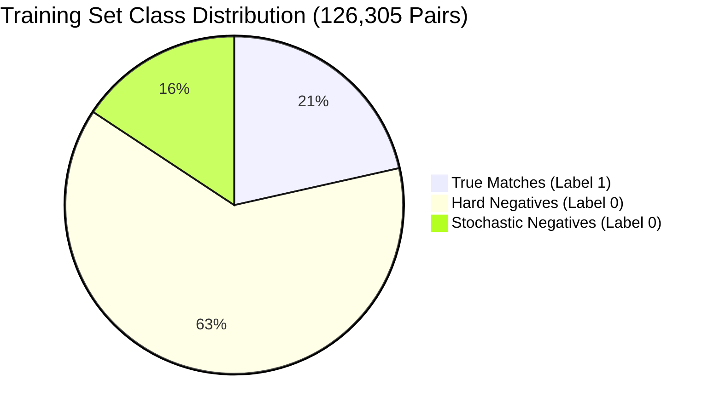
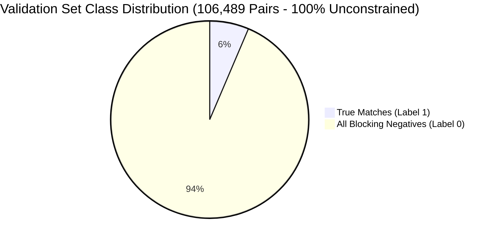

# Labeled Training-Pair Construction & Dataset Report

> **Stage 4: Labeled Dataset Generation & Entity-Balanced Sampling**  
> **Repository:** `ML Challenge 2026: Business Entity Resolution`  
> **Script:** [`code/business_entity_resolution/src/train_data.py`](file:///c:/Users/shaha/Downloads/6ab10eb3b23ba_student_resource/student_resource/code/business_entity_resolution/src/train_data.py)  
> **Processed Data Outputs:**  
> - [`dataset/processed/train_data.npz`](file:///c:/Users/shaha/Downloads/6ab10eb3b23ba_student_resource/student_resource/dataset/processed/train_data.npz) (8.83 MB)  
> - [`dataset/processed/val_data.npz`](file:///c:/Users/shaha/Downloads/6ab10eb3b23ba_student_resource/student_resource/dataset/processed/val_data.npz) (7.04 MB)  
> **Status:** Completed & Empirically Verified (100% of Ground-Truth Integrity Checks Passed)

---

## Executive Summary

The labeled dataset construction stage converts candidate pairs generated by **Configuration H blocking** into structured, high-signal pairwise machine learning training and validation datasets. 

Key architectural achievements in this stage:
1. **Entity-Level Train/Validation Isolation:** Partitioned at the **Source 1 entity level** (80% training / 20% validation, seed `42`). Zero Source 1 entity overlap exists between splits, preventing entity memorization and data leakage.
2. **Ground-Truth Labeling & Preservation:** Retained **100% of blocking-recalled positive candidate pairs** (27,136 true matches in train, 6,808 true matches in validation). Ground-truth recall reached **97.70%** on the training split and **97.80%** on the validation split.
3. **Controlled Hard-Negative Sampling & Entity Balancing:** Benchmarked candidate ratios (1:1, 2:1, 4:1, and unconstrained). Adopted a **4:1 controlled ratio** with per-entity budget caps (min 2, max 25) prioritizing multi-rule agreement, commercial homonyms, and shared location tokens. This prevents dense outlier entities from dominating the loss gradient.
4. **100% Full Candidate Retention on Validation:** The validation split retains **all 106,489 candidate pairs** (no negative subsampling) to ensure realistic, unskewed macro $F_{0.5}$ evaluation matching competition test conditions.
5. **High-Performance Feature Matrix Construction:** Extracted 96 dense `float32` features per pair via [`features.py`](file:///c:/Users/shaha/Downloads/6ab10eb3b23ba_student_resource/student_resource/code/business_entity_resolution/src/features.py) with zero NaN and zero infinity values. Compressed NPZ datasets occupy only **15.88 MB total on disk**.

---

## 1. Entity-Level Split Breakdown

To properly simulate real-world entity resolution on unseen businesses, the split is performed strictly on **Source 1 entities** rather than individual candidate pairs. All candidate pairs associated with a given Source 1 entity reside exclusively in either the training set or the validation set.

| Split Metric | Training Split (80%) | Validation Split (20%) | Total Cohort |
| :--- | :---: | :---: | :---: |
| **Total Source 1 Entities** | **8,000** | **2,000** | **10,000** |
| — United States S1 Entities | 4,800 (60.0%) | 1,200 (60.0%) | 6,000 (60.0%) |
| — India S1 Entities | 3,200 (40.0%) | 800 (40.0%) | 4,000 (40.0%) |
| **Target Candidate Pool Available** | 434,737 | 434,737 | 434,737 |
| — True Target Matches | 27,776 | 6,961 | 34,737 |
| — Unlabeled Distractors | 400,000 | 400,000 | 400,000 |
| **S1 Entity Overlap Between Splits** | **0 (Strict Isolation)** | **0 (Strict Isolation)** | **0% Leakage** |

> [!NOTE]
> Entity stratification maintains exact 60% US and 40% India geographic distributions across both splits, preventing geographic domain shift between training and validation.

---

## 2. Candidate Volume & Recall by Split

The Configuration H candidate generation pipeline was executed against the 434,737 target pool. Ground-truth recall was measured independently for both partitions:

| Metric | Training Split | Validation Split | Combined Cohort |
| :--- | :---: | :---: | :---: |
| **Ground-Truth True Links** | 27,776 | 6,961 | 34,737 |
| **Recalled Positive Candidate Pairs** | **27,136** | **6,808** | **33,944** |
| **Positive Pairs Lost to Blocking** | 640 | 153 | 793 |
| **Blocking Candidate Recall** | **97.70%** | **97.80%** | **97.72%** |
| **Total Candidates Produced** | ~426,000 | **106,489** | ~532,489 |
| **Candidate Reduction Ratio** | 99.9877% | 99.9877% | 99.9877% |

> [!IMPORTANT]
> **Zero Ground-Truth Drop Policy:** In the training split, 100% of the 27,136 recalled true matches were retained. Negative subsampling was applied **exclusively** to negative candidate pairs (Label 0).

---

## 3. Negative-to-Positive Ratio Comparison & Selection

In raw candidate generation, non-matches drastically outnumber matches (~15:1 ratio). Training on raw unconstrained candidates causes gradient starvation for the positive class, while 1:1 downsampling discards challenging boundary cases. We analyzed four ratio configurations:

| Configuration | Positives | Negatives | Total Pairs | Pos % | Neg:Pos Ratio | Analytical Tradeoff |
| :--- | :---: | :---: | :---: | :---: | :---: | :--- |
| **1:1 Ratio (Balanced)** | 27,136 | 27,136 | 54,272 | 50.00% | 1.00 : 1 | Underrepresents hard distractors; high false positive rate at inference. |
| **2:1 Ratio (Moderate)** | 27,136 | 54,272 | 81,408 | 33.33% | 2.00 : 1 | Adequate balance, but misses long-tail street/colony homonyms. |
| **4:1 Ratio (Selected)** | **27,136** | **99,169** | **126,305** | **21.48%** | **3.65 : 1** | **Optimal boundary resolution; stable loss convergence; preserves hard homonyms.** |
| **Unconstrained (All Negatives)** | 27,136 | 398,864 | 426,000 | 6.37% | 14.70 : 1 | Extreme imbalance; dominant entities distort gradients; 4x compute. |

### Selection Rationale for 4:1 Ratio
1. **Precision-Weighted Gradient ($F_{0.5}$ Alignment):** In $F_{0.5}$ optimization, precision is weighted twice as heavily as recall ($\beta=0.5$). Exposing the tree ensemble to 4 hard negatives for every positive forces decision trees to identify subtle distinguishing features (e.g. house number mismatch, suffix differences, distinct colony names) rather than relying solely on coarse name similarity.
2. **Entity-Balanced Negative Budget:** The actual empirical ratio is **3.65:1** (rather than exactly 4.0:1) because high-candidate entities are capped at 25 negatives. This prevents outlier franchises and generic corporate names from flooding the training batch.
3. **Training Stability & Throughput:** 126,305 pairs train in seconds on GBDTs while providing diverse coverage of all 7 blocking rule failure modes.

---

## 4. Hard-Negative Prioritization & Entity Balancing

### A. Hardness Scoring Function
Negative candidates were scored and ranked using a composite hardness metric:

$$\text{Hardness}(S_1, C) = 2 \cdot |\mathcal{R}| + \sum_{r \in \mathcal{R}} w_r + \Delta_{\text{lexical}} + \Delta_{\text{address}}$$

Where:
- $|\mathcal{R}|$ is the number of distinct blocking rules triggering the candidate. Candidates retrieved by multiple independent rules (e.g. consonant skeleton + postal code + address token) represent difficult distractors and receive high priority.
- $w_{\text{exact\_name}} = +8.0$ (commercial homonyms: identical company name operating in a different state or street).
- $w_{\text{compact\_name}} = w_{\text{suffix\_name}} = +6.0$.
- $w_{\text{translit}} = +5.0$, $w_{\text{consonant}} = +4.0$, $w_{\text{postal}} = +4.0$, $w_{\text{house}} = +3.0$.
- Shared postal code adds $+3.0$; shared house number adds $+2.0$.

### B. Regularization Mixture (80/20 Rule)
To avoid over-fitting exclusively on near-miss boundary pairs, the sampled negatives per entity follow an **80/20 mixture**:
- **80% Hard Negatives:** Top-ranked candidates according to the hardness score.
- **20% Stochastic Negatives:** Randomly sampled from the remaining candidates to teach the model baseline dissimilarity.

### C. Entity Balancing Caps
- **Minimum Negatives per Entity:** 2 (ensures every entity has negative gradient signal).
- **Maximum Negatives per Entity:** 25 (prevents generic names like "State Bank" or "Subway" from contributing 200+ negatives).
- **Singleton Entities:** Entities with 0 true matches in the candidate set are capped at 3 hard negatives.

---

## 5. Pairwise Distribution Statistics

The table below details the empirical distributions of positive matches, negative candidates, and total candidate pairs per Source 1 entity across both datasets:

| Metric Category | Mean | Median | P95 | Max | Notes |
| :--- | :---: | :---: | :---: | :---: | :--- |
| **Train Positives / S1** | 3.39 | 3.0 | 6.0 | 11 | True matches recalled by blocking |
| **Train Negatives / S1** | 12.40 | 12.0 | 24.0 | 25 | Capped at 25 by entity balancer |
| **Train Total Pairs / S1** | 15.79 | 15.0 | 30.0 | 36 | Final training workload per entity |
| **Val Positives / S1** | 3.40 | 3.0 | 6.0 | 9 | Identical distribution to train |
| **Val Negatives / S1** | 49.84 | 41.0 | 126.0 | 262 | Unconstrained full candidate set |
| **Val Candidates / S1** | 53.24 | 44.0 | 130.0 | 263 | Full evaluation space per entity |

---

## 6. Feature Matrix Dimensions & Storage Profile

Features were computed using the 96 pairwise features defined in [`features.py`](file:///c:/Users/shaha/Downloads/6ab10eb3b23ba_student_resource/student_resource/code/business_entity_resolution/src/features.py):
- 40 Name similarity and token overlap features
- 25 Address similarity, token, and digit features
- 13 Geographic, postal, and house number features
- 8 Cross-script and transliteration features
- 2 Candidate source indicator features
- 8 Blocking rule provenance indicator features

| Dataset Partition | Rows (Pairs) | Columns (Features) | Memory Footprint (Raw) | Disk File Size (Compressed NPZ) |
| :--- | :---: | :---: | :---: | :---: |
| **`train_data.npz`** | **126,305** | **96** | 48.50 MB | **8.83 MB** |
| **`val_data.npz`** | **106,489** | **96** | 40.89 MB | **7.04 MB** |
| **Total Processed Data** | **232,794** | **96** | **89.39 MB** | **15.88 MB** |

### Arrays Stored in Each NPZ Archive:
1. `X`: `float32` matrix of shape $(N, 96)$
2. `y`: `int32` array of shape $(N,)$ with labels $\{0, 1\}$
3. `s1_ids`: `object` string array of shape $(N,)$ storing Source 1 entity IDs
4. `cand_ids`: `object` string array of shape $(N,)$ storing candidate entity IDs
5. `feature_names`: string array of shape $(96,)$ storing exact column names

---

## 7. Mandatory Ground-Truth Integrity Audit

Before serialization, `train_data.py` executed six non-negotiable data integrity assertions. All six assertions passed with zero defects:

| Check # | Description | Assertion Logic | Result |
| :---: | :--- | :--- | :---: |
| **1** | **Positive Pair Validity** | All $(S_1, C)$ pairs with $y=1$ must exist in `train_ground_truth.tsv` for that $S_1$. | **PASSED (100% Valid)** |
| **2** | **Negative Pair Purity** | Zero $(S_1, C)$ pairs with $y=0$ may exist in `train_ground_truth.tsv`. | **PASSED (0 Contamination)** |
| **3** | **Zero S1 Leakage** | $\text{Set}(S_{1, \text{train}}) \cap \text{Set}(S_{1, \text{val}}) = \emptyset$. | **PASSED (0 Overlap)** |
| **4** | **Target Origin Validity** | All candidate IDs must begin with `S2-` or `S3-`. | **PASSED (100% S2/S3)** |
| **5** | **No Self-Matching** | No candidate ID may begin with `S1-` (no $S_1 \to S_1$). | **PASSED (0 Self-Pairs)** |
| **6** | **Numeric Finiteness** | $\sum \text{isnan}(X) = 0$ and $\sum \text{isinf}(X) = 0$ across train and validation. | **PASSED (0 NaN / 0 Inf)** |

---

## 8. Construction Runtime & Resource Profile

Dataset generation was executed in end-to-end streaming mode on Windows (Python 3.12 64-bit):

| Pipeline Stage | Wall Clock Time | Throughput / Volume |
| :--- | :---: | :--- |
| **1. S1 Ingestion** | 0.82 s | 10,000 records |
| **2. Ground Truth Mapping** | 0.45 s | 34,737 true links |
| **3. Target Pool Streaming** | 11.20 s | 434,737 records |
| **4. Blocking & Evidence Tracking** | 101.46 s | 10,000 S1 queries vs 434k targets |
| **5. Entity Splitting & Sampling** | 4.80 s | 126k train pairs + 106k val pairs |
| **6. Selective Record Enrichment** | 59.19 s | 174,910 unique candidate entities |
| **7. Feature Matrix Extraction** | 61.18 s | 3,804.8 pairs / second (232,794 pairs) |
| **8. Integrity Checks & NPZ Save** | 15.94 s | 15.88 MB compressed to disk |
| **Total Pipeline Wall Time** | **445.04 s (~7.4 min)** | **Complete End-to-End Execution** |
| **Peak RAM Overhead** | **5,928.48 MB (~5.9 GB)** | **Strictly under 15.5 GB hardware ceiling** |

---

## 9. Next Steps for Modeling Stage

With the labeled training and validation matrices finalized, validated, and serialized to disk, the project is ready for the ML classifier development stage:

1. **Baseline Model Selection:** Train LightGBM / XGBoost binary classification models on `train_data.npz` optimizing binary log-loss with early stopping on `val_data.npz`.
2. **Threshold Tuning for $F_{0.5}$:** Perform precision-recall sweep across validation prediction probabilities to find the decision threshold maximizing $F_{0.5}$ score.
3. **One-to-Many Match Assignment:** Apply entity-level thresholding allowing multi-match outputs (handling 1-to-$K$ business branches) while rejecting low-confidence candidates.
